# Установка и запуск веб-сервера в Linux

## Цель работы

Освоить основные навыки установки и первоначальной настройки
веб-сервера в ОС Linux.

## Задания для выполнения

1. Используя apt-get установить Apache2 на виртуальную машину

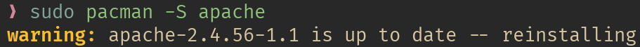

2. С браузера хост-машины по IP-адресу виртуальной машины увидеть
приветствие

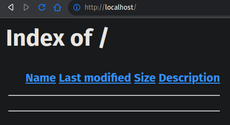

3. В настройках сервера изменить порт на :8080

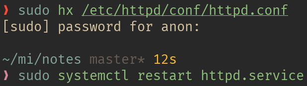

4. Снова выполнить п 2, но с указанием порта

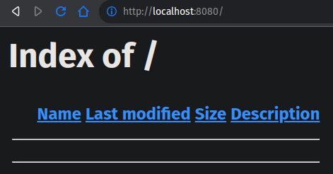

5. Изменить порт обратно и проверить как работает заглушка

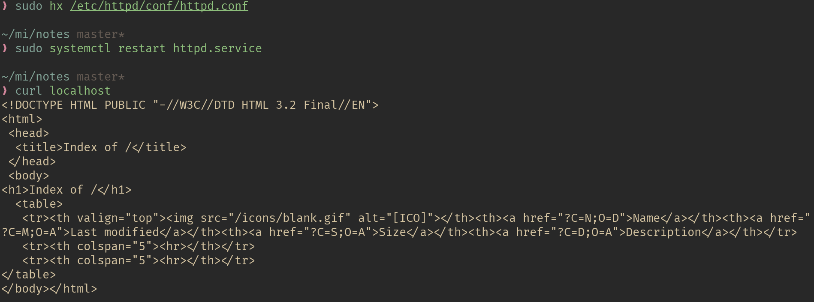

6. Запустить сервер Apache на портах 80 и 8080 одновременно и
проверить работу

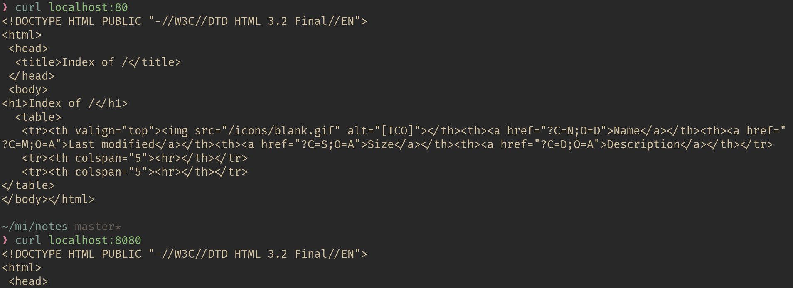

7. В hosts хост-машины создать три домена: a1.com, b2.com, c3.com и
связываем с IP виртуальной машины с Apache

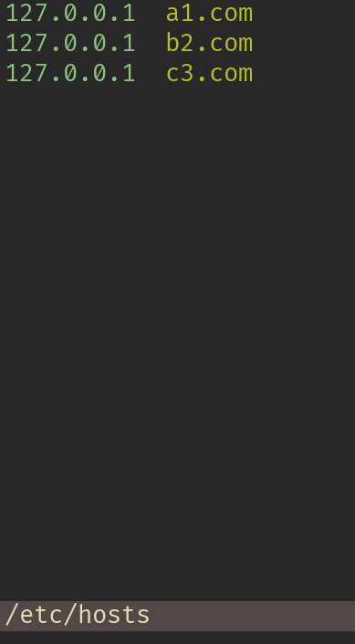

8. Для каждого домена проверить всё ли правильно, с помощью ping

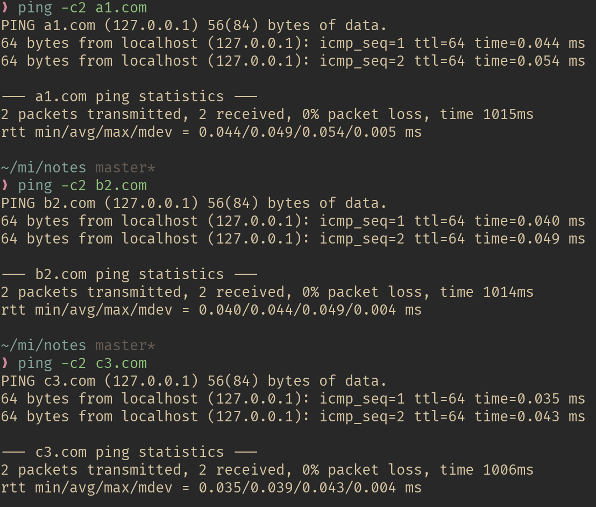

9. Зайти на все три домена, написав их вместо IP виртуальной машины

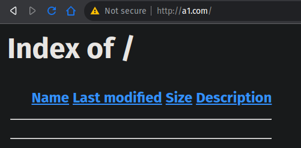
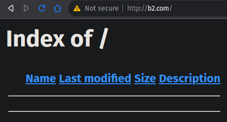
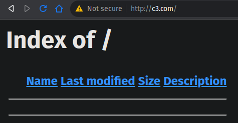

10.Создать директории /var/www/a1.com, /var/www/b2.com,
/var/www/c3.com

11.В каждой из них создать пустой index.html

12.В каждом из них написать различное содержимое

13.Сделать так, чтобы из браузеров хост-машины открывались сайты из
директории, а не общая заглушка

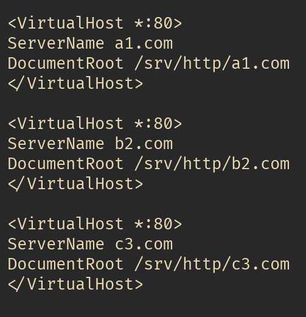

14.Запустить на выполнение скрипт, проверить отображение его в
браузере

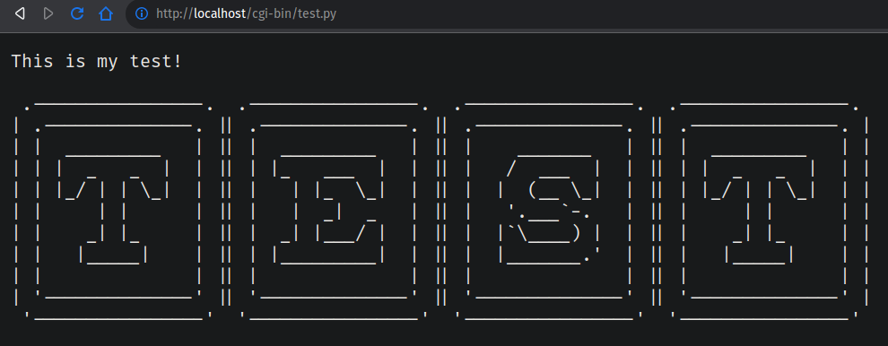

## Контрольные вопросы

1. Что такое веб-сервер и для чего нужна эта программа?
  веб-сервер принимает запросы, обрабатывает их и возвращает ответ клиенту
2. Что такое рабочая директория веб-сервера?
  место, где хранятся возвращаемые/исполняемые файлы
3. Основные настройки сервера Apache. Файл настроек.
  файл /etc/httpd/conf/httpd.conf (или /etc/apache2/httpd.conf)
  содержит множество настроек. многие функции выполнены в форме модулей
4. Что такое виртуальные хосты веб-сервера? Как настроить их в
Apache?
  позволяют держать несколько сайтов на одном сервере,
  настраиваются через директиву `<VirtualHost>`
5. Что такое файл hosts, где он находится в Windows и Linux, какой его
формат и для чего он нужен?
  сопоставляет имена хостов с IP-адресами,
  Windows: `C:\Windows\System32\drivers\etc`, Linux: `/etc/hosts`,
  формат: на каждой строчке IP, пробел(ы) и имя хоста
6. Какова основная структура HTML-файла?
  всё содержится в `<html>`, заголовок `<head>`,
  содержание опционально в `<body>`, есть множество тегов, таких как
  `<h1>`, `<a>` и `
`
